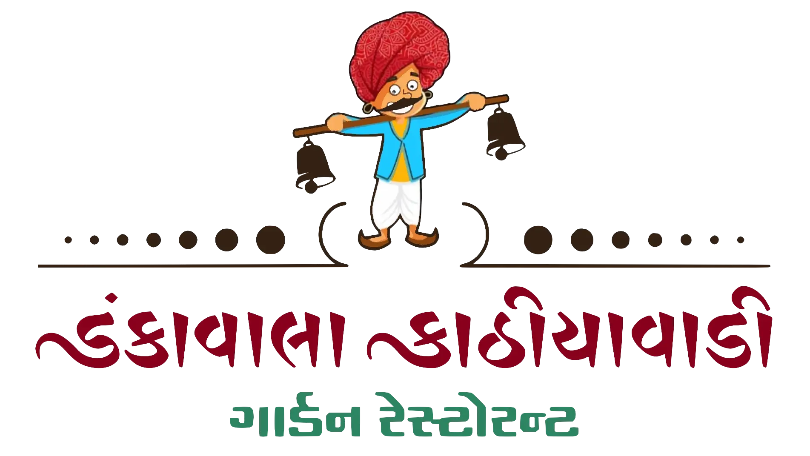

# ડાંકાવાલા કાઠિયાવાડી ગાર્ડન રેસ્ટોરન્ટ

## મેનુ

| No. | મેનુ આઇટમ્સ              | No. | મેનુ આઇટમ્સ  |
| --- | --------------------- | --- | --------- |
| ૧.  | પાણીપૂરી               | ૧૦. | સેવ લસણ    |
| ૨.  | સૂપ                    | ૧૧. | દહીં ભીંડી  |
| ૩.  | છાશ                   | ૧૨. | પનીર હાંડી |
| ૪.  | સલાડ                  | ૧૩. | રોટલી     |
| ૫.  | ફ્રાઇમ્સ                | ૧૪. | પૂરી       |
| ૬.  | સ્વીટ                  | ૧૫. | દાલ ફ્રાય  |
| ૭.  | ફરસાણ                 | ૧૬. | જીરા રાઈસ |
| ૮.  | પંજાબી સબ્જી - (૧)      | ૧૭. | કઢી       |
| ૯.  | કાઠિયાવાડી સબ્જી - (૨) | ૧૮. | ખીચડી     |

## અનલિમિટેડ ડીશ 🍲

- ગ્રુપ બૂકિંગ પર ૧૦% ડિસ્કાઉન્ટ.
- *(મિનિમમ ૧૫ વ્યક્તિ).

### ઓર્ડર અપ્યા પછી 15 - 20 મિનિટ રાહ જોવા વિનંતિ.

